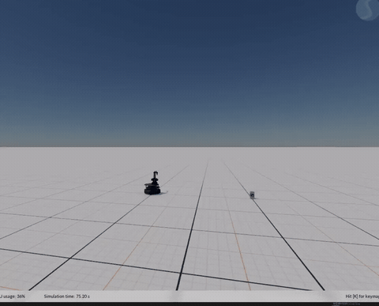
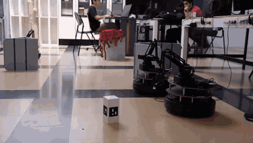

# HOI_taskPriority - ROS Package
(By: Samantha Caballero, Carlos Pazos, Raul Musito)


## Demo

Task-priority controller and behaviour tree run for both the Stonefish simulation and on the TurtleBot with 4DoF on-board manipulator.

| Stonefish simulation | Real TurtleBot |
| :---: | :---: |
|  |  |
| Base and arm coordinating to reach the detected ArUco-tagged object | Same behaviour tree operation reaching the ArUco box on the physical robot |

Full-resolution clips: [simulation](media/simulation_demo.mp4) · [real robot](media/real_robot_demo.mp4)

## Running the Simulation

To run the simulation using the provided commands, follow these steps:

1. Launch the Stonefish Simulation + Rviz :
   ```bash
   roslaunch hoi_taskpriority hoi.launch
   ```

2. In seperated terminal window, run the following node executes the Task Priority Control Algorithm with the mobile base and arm kinematics
   ```bash
   rosrun hoi_taskpriority TP_control_node.py
   ```
    This command will execute the "controller" node responsible for the ... process.

3. In another terminal, the following node will run the Aruco Detector node, which is in charge of receiving the XYZ position of detected aruco markers and publish it as a topic:
   ```bash
   rosrun hoi_taskpriority aruco_pose_detector_node.py
   ```
   
4. Finally, run the behavior tree node, which puts all the tasks together and ticks them as behaviors to run the whole operation:
   ```bash
   rosrun hoi_taskpriority behaviour_tree_node.py
   ```
